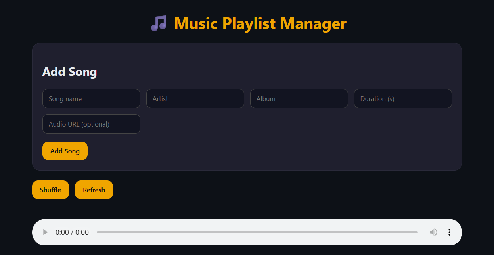

# 🎵 Music Playlist Manager

  

[](https://isocpp.org/)  
[](https://developer.mozilla.org/en-US/docs/Web/HTML)  
[](https://developer.mozilla.org/en-US/docs/Web/CSS)  
[](https://developer.mozilla.org/en-US/docs/Web/JavaScript)  

---

## **Overview**
A full-stack **Music Playlist Manager** allowing users to **add, delete, shuffle, and play songs**, and **save/load playlists** efficiently. Combines a **C++ backend** with a **web frontend** for interactive playlist management.

---

## **Features**
- Add, delete, and shuffle songs in your playlist  
- Save and load playlists using the backend (C++ file handling)  
- Play songs directly from URLs in the frontend  
- Responsive and interactive web interface  
- Thread-safe backend using C++ `mutex`  

---

## **Tech Stack**
- **Backend:** C++ (playlist management, file I/O)  
- **Frontend:** HTML, CSS, JavaScript  

---

## **Project Structure**
Music-Playlist-Manager/
│
├─ Backend code/ # C++ backend code
├─ Frontend code/ # Web interface
└─ README.md # Project documentation

yaml
Copy code

---

## **How to Run**

### Backend (C++)
```bash
cd "Backend code"
g++ "Backend code.cpp" -o playlist
./playlist   # On Windows: playlist.exe
Frontend (Web Interface)
Open Frontend code/index.html in your browser.

Use the interface to add, shuffle, or play songs.

License
This project is open-source. Feel free to use, modify, and share.
